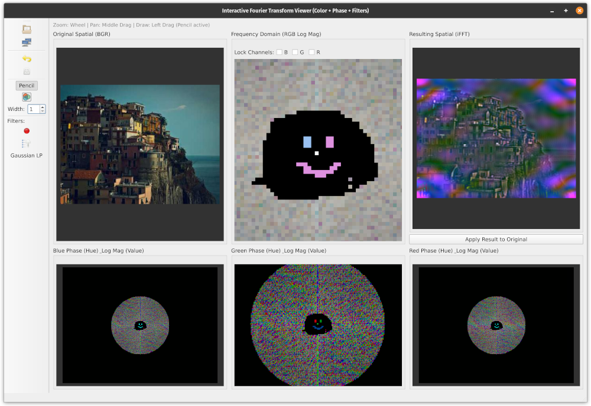

# Interactive Fourier Transform Viewer (Color + Phase)

This Python application provides an interactive environment for exploring the Fast Fourier Transform (FFT) of color images. It allows users to visualize both the magnitude and phase components of the frequency domain for each color channel (RGB) and interactively edit these components to observe the effects on the reconstructed spatial image in real-time.

This tool was developed to facilitate understanding of FFT concepts, frequency domain filtering, and the basics of how frequency manipulation relates to image appearance and potentially compression.

It is also some vibe coded slop, and the code formatting is atrocious.

## Screenshot



## Features

*   **Load Images:** Load standard image formats (PNG, JPG, BMP, TIFF) from disk or fetch random images from Lorem Picsum (color or grayscale request).
*   **Color Processing:** Handles full-color images by processing the Blue, Green, and Red channels independently.
*   **Multi-Panel View:**
    *   **Top Row:**
        1.  **Original Spatial:** Displays the current source image (editable).
        2.  **Frequency Domain (Magnitude):** Visualizes the log magnitude of the FFT (globally normalized across channels, editable).
        3.  **Resulting Spatial:** Shows the real-time result of the inverse FFT based on the current (potentially edited) frequency data.
    *   **Bottom Row:**
        1.  **Blue Channel Phase:** Hue represents phase (`-π` to `+π`), Value represents log magnitude. (Editable)
        2.  **Green Channel Phase:** Hue represents phase, Value represents log magnitude. (Editable)
        3.  **Red Channel Phase:** Hue represents phase, Value represents log magnitude. (Editable)
*   **Interactive Editing:**
    *   **Spatial Drawing:** Draw directly on the "Original Spatial" image.
    *   **Magnitude Editing:** Draw on the "Frequency Domain (Magnitude)" panel.
        *   Drawing **black** (or near-black) zeros out unlocked channels (masking).
        *   Drawing **color** sets the log magnitude of unlocked channels based on the color's intensity (relative to global max).
        *   **Channel Locks (B/G/R):** Prevent edits to specific color channels during magnitude drawing.
    *   **Phase Editing:** Draw on the B/G/R Phase panels.
        *   The **Hue** of the drawing color directly sets the phase angle for that channel.
        *   Magnitude (Value component of phase visualization) is preserved from the current state.
*   **Frequency Domain Filters:** Apply common filters directly to the frequency data:
    *   **Radial Low-Pass:** Keep frequencies within a % radius.
    *   **Log Magnitude High-Pass:** Keep frequencies with log magnitude above a % threshold.
    *   **Gaussian Low-Pass:** Smooth frequencies using a Gaussian kernel.
*   **Apply Changes:** A dedicated button ("Apply Result to Original") copies the "Resulting Spatial" image back to the "Original Spatial" panel, committing the frequency domain edits as the new baseline.
*   **Persistent Edits:** Drawings/filters applied to the frequency/phase domains persist until the "Original Spatial" image is changed (by drawing or applying results) or the "Reset Freq" button is used.
*   **View Controls:**
    *   Pan (Middle Mouse Button Drag)
    *   Zoom (Mouse Wheel, zooms towards cursor)
    *   Fit View (Toolbar button)
    *   Reset Frequency Edits (Toolbar button - reverts frequency/phase to match current spatial image).
*   **Drawing Tools:**
    *   Pencil (Enable/disable drawing)
    *   Color Picker
    *   Pen Width Selector
    *   Single-pixel precision drawing when pen width is 1.
*   **Scaling:** Uses nearest-neighbor interpolation for sharp pixel visualization when zoomed.

## Requirements

*   Python 3.x
*   PyQt5 (`pip install PyQt5`)
*   NumPy (`pip install numpy`)
*   OpenCV for Python (`pip install opencv-python`)
*   Requests (`pip install requests`)

## Installation

1.  Ensure you have Python 3 installed.
2.  Install the required libraries using pip:
    ```bash
    pip install PyQt5 numpy opencv-python requests
    ```

## Usage

1.  Save the code as a Python file (e.g., `fft_toy.py`).
2.  Run the script from your terminal:
    ```bash
    python fft_toy.py
    ```
3.  **Load Image:** Use the "Load Image" or "Random Image" buttons on the left toolbar.
4.  **Enable Drawing:** Ensure the "Pencil" tool on the toolbar is checked (it should be by default after loading an image). Select color and width as needed.
5.  **Edit:**
    *   **Spatial:** Draw on the "Original Spatial" panel. Changes immediately update frequency/phase/result panels.
    *   **Magnitude:** Draw on the "Frequency Domain" panel. Use locks to control channel edits. Changes immediately update the *display* state of the magnitude panel, the result panel, and the *value* component of the phase panels.
    *   **Phase:** Draw on the B/G/R phase panels. Changes immediately update the *display* state of the corresponding phase panel and the result panel.
6.  **Filters:** Click filter buttons on the toolbar and enter parameters when prompted. Changes update frequency/phase display states and the result panel.
7.  **Apply:** Click "Apply Result to Original" to make the current content of the "Resulting Spatial" panel the new source image. This will recompute the frequency/phase visualizations.
8.  **Reset:** Click "Reset Freq" to discard frequency/phase edits and recalculate them based on the *current* "Original Spatial" image.
9.  **View:** Use the middle mouse button to pan and the mouse wheel to zoom on any canvas. Use "Fit View" to reset pan/zoom for all canvases.

## How it Works (Briefly)

*   **FFT:** The Fast Fourier Transform decomposes the image into its constituent spatial frequencies. Low frequencies (near the center of the frequency displays) represent coarse features, while high frequencies (near the edges) represent fine details and edges.
*   **Magnitude & Phase:** Each frequency component has a magnitude (strength/amplitude) and a phase (position/alignment). Both are crucial for reconstructing the image.
*   **Color:** The application processes the Blue, Green, and Red channels independently, each having its own complex frequency representation.
*   **Visualization:**
    *   The "Frequency Domain" panel shows the logarithm of the magnitude (normalized globally) mapped to brightness (RGB).
    *   The "Phase" panels use Hue to represent the phase angle (`-π` to `+π` maps to red-green-blue-red) and Value (brightness) to represent the log magnitude (clamped to a minimum of 1 to prevent black pixels from losing hue).
*   **Editing:** Drawing modifies the underlying complex frequency data (`self.frequency_image`). Magnitude edits change the amplitude, while phase edits change the angle of the complex numbers. The *display state* arrays (`self.display_...`) are updated immediately during drawing for visual feedback.
*   **Inverse FFT:** Reconstructs the spatial image ("Resulting Spatial") from the potentially modified complex frequency data.
*   **Hermitian Symmetry:** Because the input spatial image is real-valued, its FFT mathematically possesses conjugate symmetry. Edits made in the frequency/phase domains implicitly affect symmetric points, which becomes apparent when the visualizations are updated after an edit or filter application.

## Limitations

*   **Performance:** Processing very large images might be slow, especially during live drawing updates.
*   **Memory:** Storing multiple versions of image data (original, current, result, complex, visualizations, display states) consumes memory.
*   **Live Drawing Accuracy (Thick Lines):** While single-pixel drawing is precise, the live visual feedback for *thicker* lines on the frequency/phase canvases (when modifying the NumPy arrays) might slightly differ from the final rendered line due to how the mask is applied, although the underlying data modification is correct. The final state upon mouse release (`drawingFinished`) accurately reflects the edit.

## License

[MIT](LICENSE.txt)